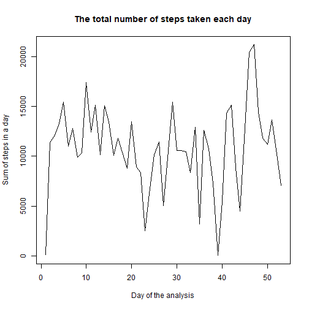
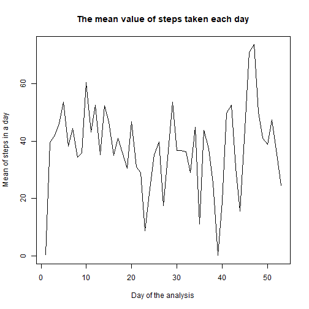
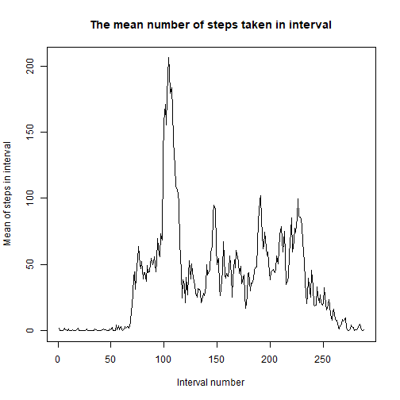
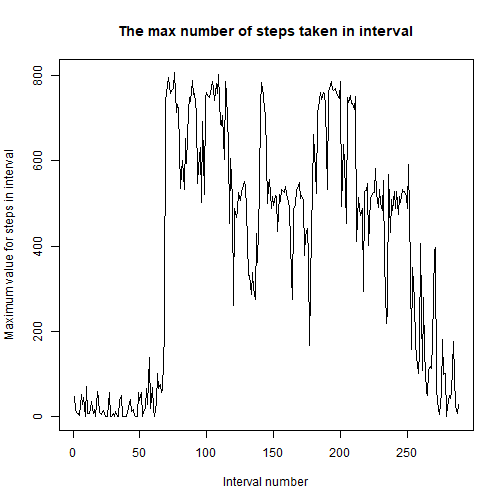
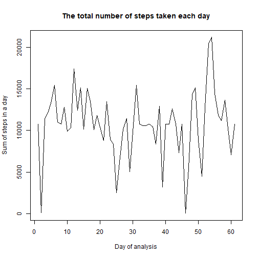
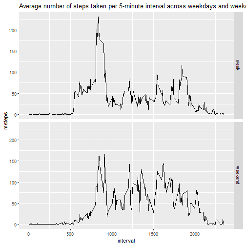

-------------------------------------------------------------

#Activity monitoring
##author: Dominika Ra

date: 11 kwietnia 2022

output: html_document


-------------------------------------------------------------

R version:
4.1.1 (2021-08-10) -- "Kick Things"
Copyright (C) 2021 The R Foundation for Statistical Computing
Platform: x86_64-w64-mingw32/x64 (64-bit)

-------------------------------------------------------------
##1. Code for reading in the dataset and/or processing the data


```r
data<-read.csv("activity.csv")
names(data)
```

```
## [1] "steps"    "date"     "interval"
```

```r
head(data)
```

```
##   steps       date interval
## 1    NA 2012-10-01        0
## 2    NA 2012-10-01        5
## 3    NA 2012-10-01       10
## 4    NA 2012-10-01       15
## 5    NA 2012-10-01       20
## 6    NA 2012-10-01       25
```

```r
str(data)
```

```
## 'data.frame':	17568 obs. of  3 variables:
##  $ steps   : int  NA NA NA NA NA NA NA NA NA NA ...
##  $ date    : chr  "2012-10-01" "2012-10-01" "2012-10-01" "2012-10-01" ...
##  $ interval: int  0 5 10 15 20 25 30 35 40 45 ...
```

```r
summary(data)
```

```
##      steps            date              interval     
##  Min.   :  0.00   Length:17568       Min.   :   0.0  
##  1st Qu.:  0.00   Class :character   1st Qu.: 588.8  
##  Median :  0.00   Mode  :character   Median :1177.5  
##  Mean   : 37.38                      Mean   :1177.5  
##  3rd Qu.: 12.00                      3rd Qu.:1766.2  
##  Max.   :806.00                      Max.   :2355.0  
##  NA's   :2304
```
##I create a datebase without NA's

```r
data1<-data[which(data$step>=0), ]
dim(data1)
```

```
## [1] 15264     3
```

##2. Histogram of the total number of steps taken each day


```r
plot(tapply(data1$steps,data1$date,sum),type ="l",xlab="Day of the analysis",ylab = "Sum of steps in a day", main = "The total number of steps taken each day")
```




##3. Mean and median number of steps taken each day


```r
library(dplyr)
```

```
## 
## Dołączanie pakietu: 'dplyr'
```

```
## Następujące obiekty zostały zakryte z 'package:stats':
## 
##     filter, lag
```

```
## Następujące obiekty zostały zakryte z 'package:base':
## 
##     intersect, setdiff, setequal, union
```

```r
by_date<-group_by(data1,date)
summarize(by_date,mean(steps),median(steps))
```

```
## # A tibble: 53 x 3
##    date       `mean(steps)` `median(steps)`
##    <chr>              <dbl>           <dbl>
##  1 2012-10-02         0.438               0
##  2 2012-10-03        39.4                 0
##  3 2012-10-04        42.1                 0
##  4 2012-10-05        46.2                 0
##  5 2012-10-06        53.5                 0
##  6 2012-10-07        38.2                 0
##  7 2012-10-09        44.5                 0
##  8 2012-10-10        34.4                 0
##  9 2012-10-11        35.8                 0
## 10 2012-10-12        60.4                 0
## # ... with 43 more rows
```


##4. Time series plot of the average number of steps taken


```r
plot(tapply(data1$steps,data1$date,mean),type ="l",xlab="Day of the analysis",ylab = "Mean of steps in a day", main = "The mean value of steps taken each day")
```




##5. The 5-minute interval that, on average, contains the maximum number of steps


```r
plot(tapply(data1$steps,data1$interval,mean),type ="l",xlab="Interval number",ylab = "Mean of steps in interval", main = "The mean number of steps taken in interval")
```



```r
plot(tapply(data1$steps,data1$interval,max),type ="l",xlab="Interval number",ylab = "Maximum value for steps in interval", main = "The max number of steps taken in interval")
```




##6. Code to describe and show a strategy for imputing missing data


```r
sum(is.na(data$steps))
```

```
## [1] 2304
```


```r
sum(is.na(data$steps))/nrow(data)*100
```

```
## [1] 13.11475
```

###The total number of rows with NA = ` r bledy`. NA's account for ` r total` % of all rows.

###The NA's were fill in with mean for a interval

```r
data1<-data[which(data$step>=0), ]
by_interval<-group_by(data1,interval)
inter_df<-data.frame(summarize(by_interval,mean(steps)))
head(inter_df)
```

```
##   interval mean.steps.
## 1        0   1.7169811
## 2        5   0.3396226
## 3       10   0.1320755
## 4       15   0.1509434
## 5       20   0.0754717
## 6       25   2.0943396
```

```r
data_na<-data[is.na(data$steps), ]
data_na_ok<-merge(data_na,inter_df,by.x = "interval",by.y = "interval")
data_na_ok1<-select(data_na_ok, mean.steps.,date,interval)
data_na_ok2<-rename(data_na_ok1,steps = mean.steps.)
data_total<-rbind(data1,data_na_ok2)
dim(data_total)
```

```
## [1] 17568     3
```

```r
head(data_total)
```

```
##     steps       date interval
## 289     0 2012-10-02        0
## 290     0 2012-10-02        5
## 291     0 2012-10-02       10
## 292     0 2012-10-02       15
## 293     0 2012-10-02       20
## 294     0 2012-10-02       25
```
##7. Histogram of the total number of steps taken each day after missing values are imputed

```r
plot(tapply(data_total$steps,data_total$date,sum),type ="l",xlab="Day of analysis",ylab = "Sum of steps in a day", main = "The total number of steps taken each day")
```




##8. Panel plot comparing the average number of steps taken per 5-minute interval across weekdays and weekends

```r
data_total_w<-mutate(data_total,date=as.Date(date))
data_total_w1<-mutate(data_total_w,weekdays(date))
slownik<-data.frame(weekdays=c("poniedziałek","wtorek","środa","czwartek","piątek","sobota","niedziela"),rodzaj = c("week","week","week","week","week","weekend","weekend"))
slownik
```

```
##       weekdays  rodzaj
## 1 poniedziałek    week
## 2       wtorek    week
## 3        środa    week
## 4     czwartek    week
## 5       piątek    week
## 6       sobota weekend
## 7    niedziela weekend
```

```r
data_total_w2<-merge(data_total_w1,slownik,by.x="weekdays(date)",by.y="weekdays")
data_total_w3<-select(data_total_w2,steps,interval,rodzaj)
by_interval_total<-group_by(data_total_w3,rodzaj,interval)
a<-summarize(by_interval_total,mean(steps))
```

```
## `summarise()` has grouped output by 'rodzaj'. You can override using the `.groups` argument.
```

```r
a<-rename(a,msteps = "mean(steps)")
library(ggplot2)
qplot(interval,msteps,data=a,facets=rodzaj~.,geom = c("line") ,main = "Average number of steps taken per 5-minute interval across weekdays and weekends") 
```




